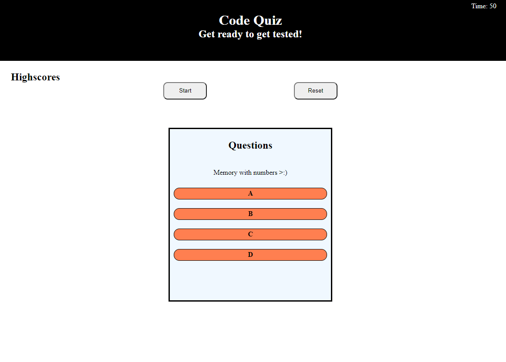

<!-- PROJECT LOGO -->
  <h1 align="center"># Web APIs Challenge: Code Quiz (Math Quiz for the lulz</h1>

  <p align="center">
    A simple time based quiz to get your mind working with some math questions :D!!!!!


<!-- TABLE OF CONTENTS -->
<details open="open">
  <summary>Table of Contents</summary>
  <ol>
    <li>
      <a href="#about-the-project">About The Project</a>
      <ul>
        <li><a href="#built-with">Built With</a></li>
      </ul>
    </li>
    <!-- <li> -->
      <a href="#getting-started">Getting Started</a>
      <!-- <ul> -->
        <!-- <li><a href="#prerequisites">Prerequisites</a></li> -->
        <!-- <li><a href="#installation">Installation</a></li> -->
      <!-- </ul> -->
    <!-- </li> -->
    <li><a href="#usage">Usage</a></li>
    <!-- <li><a href="#roadmap">Roadmap</a></li> -->
    <!-- <li><a href="#contributing">Contributing</a></li> -->
    <li><a href="#license">License</a></li>
    <li><a href="#contact">Contact</a></li>
    <!-- <li><a href="#acknowledgements">Acknowledgements</a></li> -->
  </ol>
</details>


<!-- ABOUT THE PROJECT -->
## About The Project



A fun, fast paced math quiz!! It goes from a basic 0+1... How fast can you be?... done as part of my 4th project for the UofT bootcamp

It presents the user with a multiple choice question. Awards +5 secs if you get the question right, but be carefull because you lose 5 seconds for getting it wrong!

### Built With

* [HTML]
* [JS]
* [CSS]


<!-- GETTING STARTED -->
## Getting Started

Press Start and have fun...

<!-- ### Prerequisites -->

<!-- This is an example of how to list things you need to use the software and how to install them.
* npm
  ```sh
  npm install npm@latest -g
  ``` -->

<!-- ### Installation
## Instalation


<!-- USAGE EXAMPLES -->
## Usage

The highscore database is a work in progress.... 

<!-- ROADMAP
## Roadmap


<!-- CONTRIBUTING -->
<!-- ## Contributing


<!-- LICENSE -->
## License

Free to use, share the knowledge!!.


<!-- CONTACT -->
## Contact

Said Hadad - saiddavid.hadad@gmail.com

Project Link: [https://github.com/your_username/repo_name](https://saidhadad.github.io/Challenge-4-Code-Quiz//)


<!-- ACKNOWLEDGEMENTS -->
<!-- ## Acknowledgements

<!-- MARKDOWN LINKS & IMAGES -->